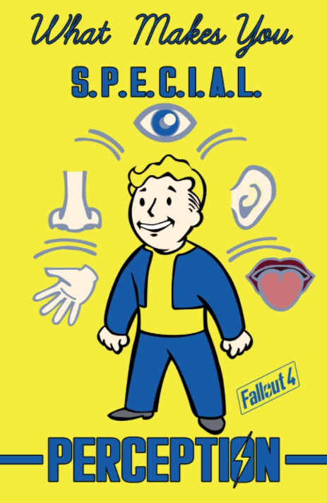
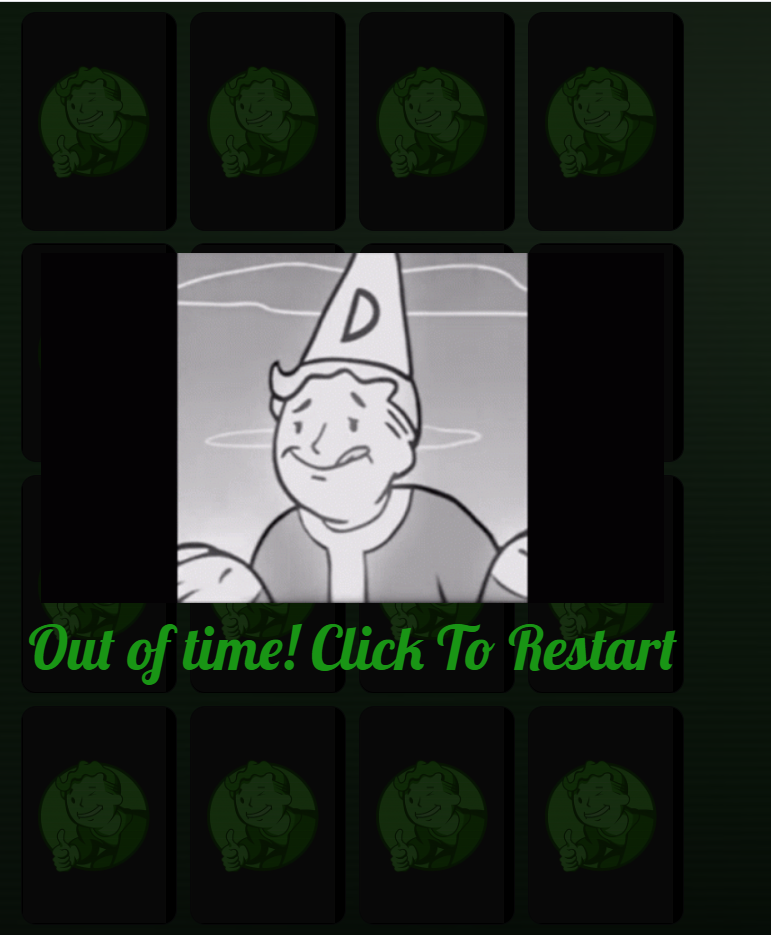

# Atomic Memory - Memory Game

## About Atomic Memory

### Atomic Memory is a memory game inspired and based on the Fallout game series by Bethesda.
### This game is a fantastic way to have fun and also boost brain activity by memorizing the cards.   For the fans of the series this is a great way to play a themed memory game.

### Playing memory games can help improve brain functions such as:
  *  Focus
  * Concentration 
  * Visual Recognition 
  * Short-Term Memory

# User Experience (UX)

# Strategy 

## User Stories 

### Reasons why a user would play this game
 
* Improve Short-Term memory
* Improve Focus and Concentration
* Stress Relief 
* Fan of the Fallout Franchise

### Reasons for creating this game

* Provide a fun and interactive way of helping with certain cognitive skills

# Scope

## What to expect as a User

# Features

## Existing Features

* Start Game Overlay

* Header

   * The header is essentially an Overlay Starter, that allows the user to start the game once Clicked.

* Game Interface / Card Layout 

  * The game interface consists of a Grid, that is divisable for better responsiveness in smaller screens. 

* Perk Cards

  * The Perk Cards are inspired by the Perk cards from Fallout 76. 
  * All Cards initial letters spell S.P.E.C.I.A.L, which is an acronym for the 7 body senses.
  * All this cards are in reference to the original fallout games, which will give the user a sense of familiarity

* Timer / Flips

  * The Timer and Flips Counter are written inside of the main header div. 
  * To be able to make both Timer and Flips work, a combination of classes and Ids were used in the HTML, and Later targeted in the Javascript, making it able to Time the game everytime the main screen is clicked and count the mover per each card click. 

* Victory Overlay / Modal

   * The Victory Overlay, Shows up to congratulate the user that their time has ran out and they have lost the game.
   * A normal normal div was used to store all the text. Together with the CSS and Javascript enabled the Overlay animation and functionality.
   * The message also contains a Victory gif with the Vault Boy theme.

* Game Over Overlay / Modal

  * The Game Over Overlay, Shows up to commiserate the user that their time has ran out and they have lost the game.
   * A normal normal div was used to store all the text. Together with the CSS and Javascript enabled the Overlay animation and functionality.
   * The message also contains a Defeat gif with the Vault Boy theme.

## Features Left to implement

  * A move counter Limit, which would also equal to a game over.

# Technologies Used

* This project uses HTML, CSS, Bootstrap, and JavaScript.
* The project was developed using Gitpod.
* This project uses GitHub for Storing and Deployment.

# Testing 
|Test Label  | Test Action | Expected Outcome | Test Outcome |
|:--|:--|:--|:--:|
| Timer/Move Counter | When clicked Start it starts ticking the time. When clicked on a card the move count goes up. |All the features are responsive and act as they should | PASS 
|Card Table / Grid | Clicked in each card, making sure no more than to turn at once.   Matched the cards to be able to see if they respond and stay facing up as expected | All cards match with their pairs, and no more than two turns each time | PASS 
|Victory / Game Over Overlays | Played the game through matching all the cards, a victory overlay message shows and disappears once clicked on, restarting a new game   Purposely let the timer run out, a Game over overlay message shows and disappears once pressed start a new game | The Overlays appear only when there is an action of Victory or Game Over, and are easily cleared once clicked, to be able to Start a new game | PASS
|Footer | Refreshed the page, made sure the footer stays at the bottom of the page | The footer is responsive and stays at the bottom of the page | PASS |

## Validator Testing
* CSS
  * No errors were found when testing on the official [Jigsaw validator](https://jigsaw.w3.org/css-validator/)

* HTML

  * No errors were found when testing on the official [W3C Validator](https://validator.w3.org/)

## Browser Compatibility 
 * This website has been tested and verified to work on various browsers such as : Chrome, Firefox and Edge.

## Responsiveness

### Am I Responsive?

 
 * This website has been tested on small, medium and large screens. 
 * This website even thought playble and visible in small screens, it doesn't provide the best user experience.
 * Xs screens have only been tested in the responsive setting on Google Developer tools. 

# Deployment 

* The website was deployed to GitHub pages.
The steps taken were the following:
  
  1. On the prefered Internet Browser, access [Google](https://www.google.com/)
  2. On [Google](https://www.google.com/), type in Github to access the [Github](https://github.com/) page
  3. When accessing [Github](https://github.com/) create an account following the provided steps
  4. After creating an account and profile, create a new/first repository by clicking on "New"
  5. With the new repository now in place the project can now be started
  6. After the project is concluded it is ready for deployment 
  7. For deployment access the settings on the GitHub repository
  8. On the left hand side menu, navigate and select the Master Branch.
  9. Once the master branch is selected, the page will automatically refresh and display a message for the successful deployment.

* For GitHub page live link [Click here!](https://deborasantos28.github.io/milestone-project-1/)
Need to include user stories 

# Credits

* For this Project I took Ideas and followed a tutorial from the following two youtube videos:
[How to Make a card game](https://www.youtube.com/watch?v=28VfzEiJgy4&list=PLXukZvc39PEfAzj9ex0SToyUYfAxbCG_y&index=14)
[The JavaScript Part of this video](https://www.youtube.com/watch?v=3uuQ3g92oPQ)

* For the Media Queries I used the W3Schools example provided. 

* All Credits for the franchise go to Bethesda Softworks, as Fallout is their product.

* This project was made using some Bootstrap.

## Contents

## Resources 
* Images
   * All Perk Cards were taken from Pinterest by different authors [Pinterest](https://www.pinterest.co.uk/); 
   * Backgrounds and Gifs were found on Google from various authors [Google](https://www.google.co.uk/)
  

* Colour Palette
   * [COLOURlover](https://www.colourlovers.com/palette/3428762/Fallout?widths=1) 

